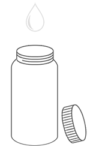
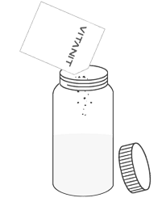

# Инструкция по приготовлению Vitanit
v 2.1

0. Возьмите бутылку / шейкер / стакан объёмом 600 мл.

0. Добавьте воду или молоко (0,3 л) и после добавьте порцию Vitanit

0. Размешайте до однородной массы
